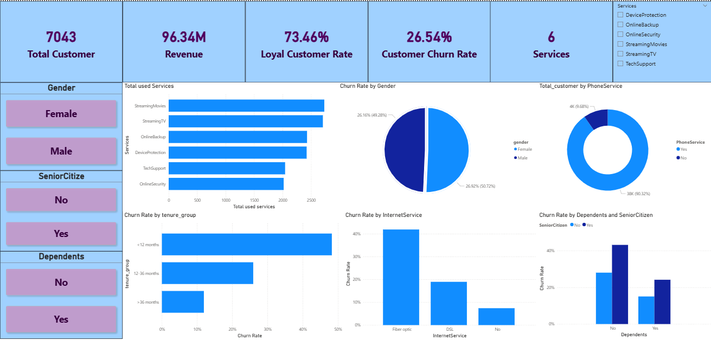

# 📡 Telecom Customer Churn Analysis (Power BI + Python + Machine Learning)

## 📌 Project Overview

This project analyzes customer churn in the telecommunications industry using **Python for data preprocessing**, **Power BI for visualization**, and **Machine Learning (Logistic Regression)** for churn prediction. The objective is to identify key churn drivers and build a predictive system to support proactive customer retention strategies.

---

## 🎯 Objectives

* Analyze customer churn behavior and key influencing factors
* Build interactive dashboards for business insights
* Develop a predictive model to classify churn risk
* Simulate real-time churn prediction using Streamlit

---

## 📂 Dataset

* **Source:** Telco Customer Churn Dataset (CSV)
* **Records:** 7,043 customers
* **Key Features:**

  * CustomerID,gender,SeniorCitizen,Partner,Dependents
  * Tenure,PhoneService,MultipleLines,InternetService
  * OnlineSecurity,OnlineBackup,DeviceProtection,TechSupport
  * StreamingTV,StreamingMovies,Contract,
  * PaperlessBilling,PaymentMethod,MonthlyCharges,TotalCharges
  * Churn (Target Variable)

---

## 🧹 Data Preparation (Python)

### Steps:

* Imported dataset using `pandas`
* Handled missing values and cleaned `TotalCharges`
* Converted `SeniorCitizen` into categorical (Yes/No)
* Removed duplicates based on `CustomerID`

### Feature Engineering:

* **Tenure Group**

  * < 12 months
  * 12–36 months
  * > 36 months

* **Total Services**

  * Count of services used (Phone, Internet, Security, etc.)

  * Exported cleaned dataset for Power BI

---

## 🔍 Data Exploration (Power BI)

### DAX Measures

* **Churn Rate (Overall & by segment)**
* **Average Tenure by Internet Service**

### Key Analysis

* Impact of **OnlineSecurity** on churn
* Customer distribution by **Gender** and **Partner**
* Service usage patterns and churn behavior

---

## 📊 Visualizations & Dashboard

### Key Visuals

* 📊 Bar Chart: Churn Rate by Internet Service
* 📈 Line Chart: Churn Rate by Tenure Group


### Dashboard Features

* Interactive dashboard with slicers:

  * Dependents
  * SeniorCitizen

* Drill-down and detailed tooltips

---
## 🖼️ Dashboard Preview



---
## 🤖 Machine Learning Model

### Model: Logistic Regression

* Used for binary classification (Churn / Not Churn)
* Built a correlation matrix to identify important features
* Features identified from the correlation matrix include:

  * Contract, tenure, OnlineSecurity, TechSupport, MonthlyCharges

### Workflow:

* Data preprocessing (encoding, scaling)
* Train-test split
* Model training and evaluation (Accuracy, Precision, Recall, Confusion matrix)

### Result:

* Successfully built a model to **predict customer churn probability**

---

## 🌐 Streamlit App (Real-time Prediction)

* Developed a **Streamlit web app** for churn prediction
* Users can input customer data:

  * Tenure, Services, Charges, etc.
* The system outputs:

  * ✅ Churn / ❌ No Churn prediction
* Simulates real-world usage where new customer data is evaluated instantly

---

## 💡 Key Insights

* High churn rate (**26.54%**) indicates significant retention risk
* **New customers (<12 months)** have the highest churn (~48%)
* **Fiber optic users** show the highest churn (>40%) → service quality concerns
* **OnlineSecurity & TechSupport** reduce churn significantly
* Senior customers without dependents are the most vulnerable segment

---

## 🚀 Recommendations

* Improve **onboarding experience** for new customers
* Optimize **Fiber optic service quality and pricing**
* Bundle **Internet + TechSupport/OnlineSecurity** to reduce churn
* Provide personalized support for **senior customers living alone**
* Promote cross-selling to increase service usage and retention

---

## 🗂️ Project Structure

```
telecom-customer-churn-analysis/
│
├── data/
│   └── Telco-Customer-Churn.csv
│      
├── data_processed/
│   └──  Telco-Customer-Churn-Cleaned.csv
│
├── notebooks/
│   └── prepaired_data.ipynb
│   └── predict_churn_customer.ipynb
├── report/
│   └── Report.pdf
│   
│
├── model/
│   └── logistic_model.pkl
│
├── predict/
│   └── streamlit_app.py
│
├── powerBI/
│   └── project.pbix
│
├── dashboard/
│   └── dashboard.png
│
└── README.md
```

---

## 🛠 Tools & Technologies

* Python (pandas, numpy, scikit-learn)
* Power BI (DAX, Dashboard)
* Streamlit
* Machine Learning (Logistic Regression)

---

## 📌 Conclusion

This project combines **data analytics and machine learning** to provide both descriptive insights and predictive capabilities. It enables telecom companies to proactively identify at-risk customers and implement targeted retention strategies.

---

## 📎 Author

* LeNguyenKhoi
